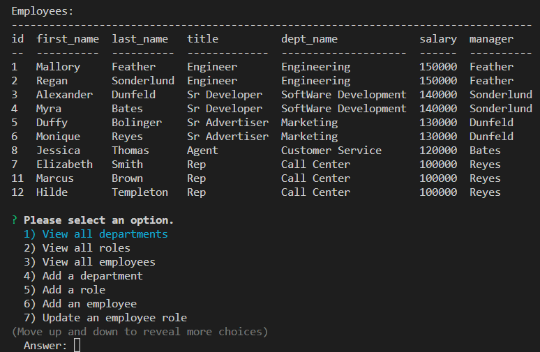
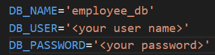
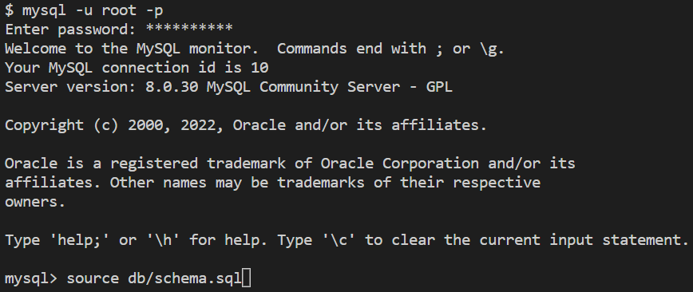
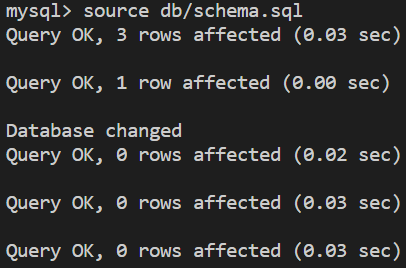
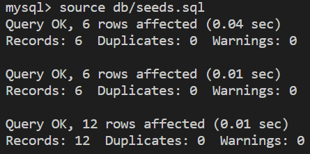

# employee-tracker

Employee-tracker is a project which would allow a manager to view employees within an orgnization, and see their name, title, salary, and who they report to, displayed in an easy to read table.

## All about relational databases!

Employee-tracker utilizes mysql to catalogue data in a relational database.  With appropriate primary and foregin key combinations, data is easily shared and merged accross tables.

## Dependencies

This project utilizes the following npm packages:

* Mysql2
* Express
* Dotenv
* Inquirer
* Console.table

## Installation

To run Employee-tracker locally on your machine, first clone the repo.  Next, add a .env file within the root directroy.  The .env file should contain the following:

* DB_NAME='employee_db'
* DB_USER=''
* DB_PASSWORD=''

Be sure to inslude your databse user and password witin the quotes.  The database will then need to be created and seeded.  Either from Mysql Workbench or the Mysql command line prompt, source the schema.sql file located in the db folder.  Next, source the seeds.sql file as well. 

As viewed from the Mysql command line application:

---

---

---

---

From the command line, run "npm i" to install the npm dependencies as listed in the package.json file.  To start the server, type "node server.js" or "npm start" if you have nodemon installed.  The server should now be listening.

## Interacting with the database

The purpose of this project is to create and interact wtih a mysql database.  The Inquirer package will prompt user responses from the command line. Based upon user responses, the Console.table package displays tables directly within the Node.js console.

## Conclusions

While on the surface, sql seems like a fairly straight forward query language, it is not without it's challenges.  Structuring queries can become complex, to further complicate the issue these queries then need to be functionally placed inside of Javascript.  This was certainly an educational process!

Please view my GitHub repo here:
 [employee-tracker](https://github.com/ObviousEcho/employee-tracker)

 A full video demonstration can be viewed here:
 [employee-tracker](https://drive.google.com/file/d/1_MyQY7Kt-idMGotJNEe12nclXXuvpgMa/view)

 Thanks!